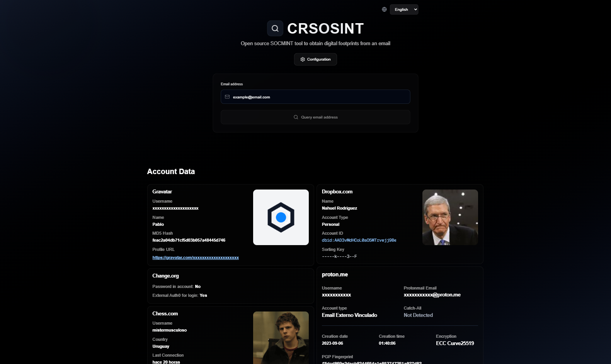
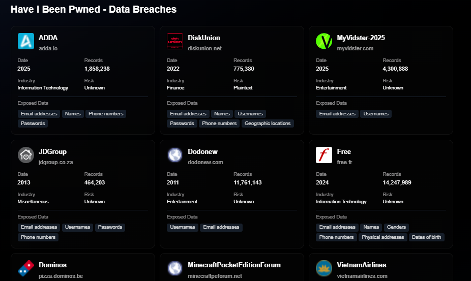
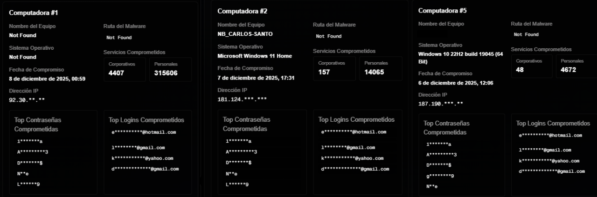

# CRSOISNT 

**CRSOSINT** is an advanced Open Source Intelligence (OSINT) suite designed for email vector-based enumeration and fingerprinting. The tool orchestrates over 30 asset recognition modules to identify the presence of a digital identity across multiple online platforms and services. Developed with a modular approach, CRSOSINT enables cyber intelligence researchers and analysts to correlate disparate data to build a comprehensive digital profile of the target, similar to enterprise reconnaissance solutions.

### Contribution and Development
The project adopts an open-source and collaborative development philosophy. The community of analysts and developers is invited to contribute new verification modules or improvements to the collection architecture. To propose new search vectors or report anomalies, please open an *Issue* or submit a *Pull Request* in this repository.



### Tech Stack
The application core is built upon modern high-performance web technologies:

- **Framework**: [Next.js 16](https://nextjs.org/) (React 19 RC)
- **Language**: [TypeScript](https://www.typescriptlang.org/)
- **Styles**: [Tailwind CSS 4](https://tailwindcss.com/)
- **OSINT Engine**: [Puppeteer](https://pptr.dev/) (Browser Automation) & [Cheerio](https://cheerio.js.org/) (HTML Parsing)
- **Iconography**: [Lucide React](https://lucide.dev/)

## Installation Guide

This project runs on **Next.js**, making it easy to deploy. You only need [Node.js](https://nodejs.org/) installed on your PC.

1. **Clone the repository**:
   ```bash
   git clone https://github.com/your-username/crsosint.git
   cd crsosint
   ```

2. **Install dependencies**:
   Run this in your terminal inside the project folder to download required libraries:
   ```bash
   npm install
   ```

3. **Start the tool locally**:
   Launch the local server with this command:
   ```bash
   npm run dev
   ```

4. **Final step to test**:
   Open your browser and navigate to: `http://localhost:3000`


## OSINT Modules Table

| Module | Registration Check | Account Info | Authorization Token | User Alert |
| :--- | :---: | :---: | :--- | :---: |
| Duolingo | ✅ | ✅ | No - Free API | No |
| Gravatar | ✅ | ✅ | No - Free API | No |
| Dropbox | ✅ | ✅ | Yes - Session Cookies | No |
| Chess | ✅ | ✅ | Yes - Session Cookies | No |
| Trello | ✅ | ✅ | Yes - Session Cookies | No |
| GitHub | ✅ | ✅ | Yes - Account API Key | No |
| Proton | ✅ | ✅ | No - Auth Detection | No |
| Flickr | ✅ | ✅ | Yes - Account API Key | No |
| Microsoft Team | ✅ | ✅ | Yes - Search Tokens | No |
| Change.org | ✅ | Partial | No - Free API | No |
| Have I Been Pwned | ✅ | Breaches | No - Free API | No |
| Hudsonrock | ❌ | Stealers | No - Free API | No |
| Facebook | ✅ | ❌ | No | No |
| Spotify | ✅ | ❌ | No | No |
| Microsoft | ✅ | ❌ | No | No |
| X (Twitter) | ✅ | ❌ | No | No |
| Adobe | ✅ | ❌ | No | No |
| Wattpad | ✅ | ❌ | No | No |
| Tumblr | ✅ | ❌ | No | No |
| Dropbox | ✅ | ❌ | No | No |
| SEOClersk | ✅ | ❌ | No | No |
| Wordpress | ✅ | ❌ | No | No |
| Github | ✅ | ❌ | No | No |
| Firefox | ✅ | ❌ | No | No |
| Zoho | ✅ | ❌ | No | No |
| Lastpass | ✅ | ❌ | No | No |
| Rumbler | ✅ | ❌ | No | No |
| Archive.org | ✅ | ❌ | No | No |
| Plurk | ✅ | ❌ | No | No |
| Instagram | ✅ | ❌ | No | Yes |
| Pornhub | ✅ | ❌ | No | No |
| Xvideos | ✅ | ❌ | No | No |
| Joomla | ✅ | ❌ | No | Yes |

## Data Breach Checks with Have I Been Pwned

Automated credential vulnerability analysis via integration with the XposedOrNot API, which acts as an authorized proxy for the Have I Been Pwned service. This module verifies the presence of an email address in known data breaches, providing exhaustive details on exposed sensitive information. The functionality is pre-configured and optimized for immediate use, eliminating the need for authorization token management or additional manual configuration.



```javascript
const email = 'example@email.com';
const encodedEmail = encodeURIComponent(email);
const apiUrl = `https://api.xposedornot.com/v1/breach-analytics?email=${encodedEmail}`;

fetch(apiUrl, {
  method: 'GET',
  headers: {
    'Accept': 'application/json',
  },
})
.then(response => response.json())
.then(data => console.log(data));
```

## HudsonRock API for Malware-Infected Device Basic Info

Integration with the Cavalier (Hudson Rock) API for advanced identification of malware compromise vectors. This module correlates an email address with devices infected by Infostealers, revealing critical indicators of compromise (IOCs) such as IP addresses, system paths, and exfiltrated credentials, providing deep insight into identity exposure in cybercrime environments.



```javascript
const email = 'example@email.com';
const url = `https://cavalier.hudsonrock.com/api/json/v2/osint-tools/search-by-email?email=${encodeURIComponent(email)}`;

fetch(url, {
  method: 'GET',
  headers: {
    'User-Agent': 'Mozilla/5.0 (Windows NT 10.0; Win64; x64) AppleWebKit/537.36'
  }
})
.then(response => response.json())
.then(data => console.log(data));
```
